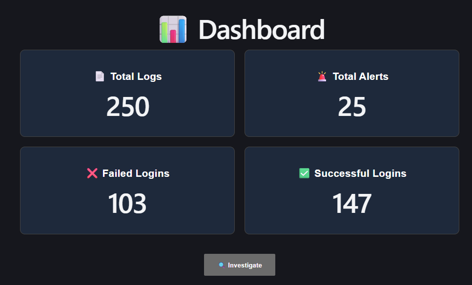
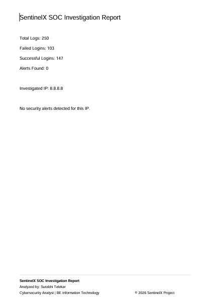

# 🛡️ SentinelX - SIEM Threat Detection Platform

A web-based Security Information and Event Management (SIEM) platform that analyzes SSH authentication logs, detects suspicious activities, investigates IP addresses, and generates professional investigation reports.

## ✨ Features

- 📂 Upload SSH log files (.log, .txt)
- 📊 Interactive Security Dashboard
- 🚨 Brute Force Attack Detection
- 🔐 Successful Login After Multiple Failures Detection
- 🔍 IP-based Investigation
- 🌍 IP Geolocation (Public IPs)
- 📄 Investigation Timeline
- 🛡 Recommended Security Actions
- 📑 Export Investigation Report (PDF)
- 📈 Dashboard Statistics
- 🎨 Modern Responsive UI

## 🛠 Tech Stack

Frontend
- React.js
- Axios
- jsPDF

Backend
- Python
- Flask
- Flask-CORS

Libraries
- ip-api (Geolocation API)
- Regular Expressions (Log Parsing)

## 📂 Project Structure

SentinelX/
├── backend/
│   ├── app.py
│   ├── parser.py
│   ├── detector.py
│   └── uploads/
│
├── frontend/
│   ├── src/
│   ├── public/
│   └── package.json

## ⚙️ How It Works

1. Upload SSH authentication logs.
2. Parse log entries.
3. Detect suspicious login activities.
4. Generate security alerts.
5. Investigate IP addresses.
6. Display geolocation information.
7. Recommend mitigation steps.
8. Export a PDF investigation report.

## 🚀 Getting Started

### Backend

cd backend
pip install -r requirements.txt
python app.py

### Frontend

cd frontend
npm install
npm run dev

## 📸 Screenshots

- Upload Page
- Dashboard
- Investigation Page 
- PDF Report

## 🎯 Future Enhancements

- Threat Intelligence Integration
- Interactive Charts
- Real-time Log Monitoring
- User Authentication
- Email Alert Notifications

## 👩‍💻 Author

Surabhi Talekar

BE Information Technology

Cybersecurity Enthusiast

## 📄 License

This project is developed for educational and portfolio purposes.